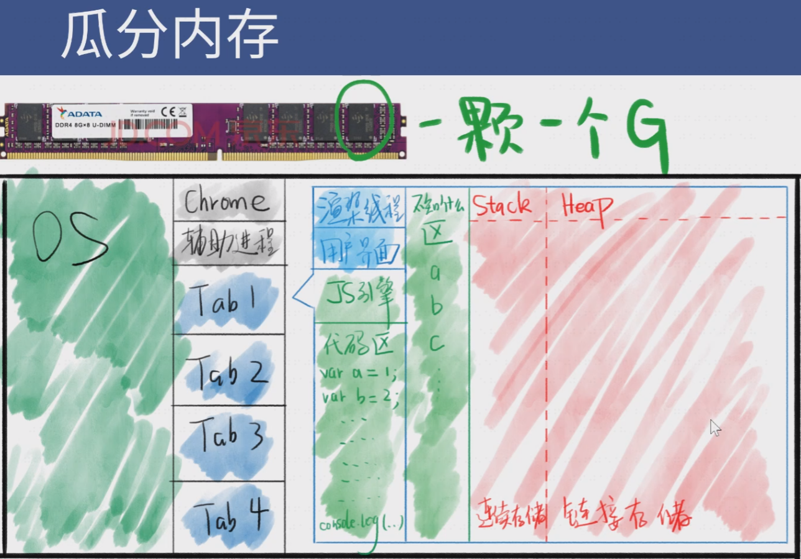

## JS 概览 （历史、内存图）

### 学习 JS 需要什么要求？

**软性要求：**

一、逻辑能力

写代码基本就是在编写逻辑；

二、质疑自己的能力

不要相信人类，包括你自己；出现 bug 时，先质疑自己，再质疑机器；

三、抽象思维（高级程序员必备能力）

抽象思维能使你的代码能解决更多的问题；而不是兵来将挡水来土掩，一个一个解决；比如 Vue 和 React 的作者；

**硬性要求：**

一、足够的代码量

（1w行→熟手，5w行→专业选手），只能靠时间积累；

如何统计自己的代码行数：
```
安装：yarn global add cloc 
cloc --vcs=git
```
可以用来统计一个仓库里的有效代码；

注意：如果仓库里有 node_modules 目录等不相关内容；

需要把 /node_module/写入 .gitignore 文件；

二、了解足够多的概念

不仅要会写，还要会说（扯）

如常考概念：闭包、原型；类、继承；MVC、Flux；高阶函数；前端工程化；

如何积累：在课堂中提炼；在大脑中思考；在博客上总结；在代码中实践；

三、有足够的踩坑经验

何谓专家：把该领域内所有错误都犯完的人就是专家；

如何踩坑：做项目，而且是个人项目（即所有代码都是你一个人写的）；这样你才能全方位地踩坑；

老师的项目留有余地，可以根据自己的想法去发挥；

### JS 简史

布兰登 在网景公司期间发明了 JS 。JavaScript 诞生之初，只是一个不起眼的小功能；同时 JS 有很多 bug ，我们学习的时候要注意辨别。

JavaScript 的诞生：布兰登临危受命花十天设计了 JS 的最初版本（不是实现）；

JS 的命名：Mocha → LiveScript → JavaScript （为了蹭 Java 的流量）；

浏览器一开始同时支持 Java 和 JavaScript ，后来 JS 胜了（浏览器上）；

浏览器大战：微软的跟进（IE3 发布，支持 JScript）与网景的反击（提交语言标准 ECMAScript）；

网景之死：微软的 IE 浏览器捆绑了 windows，导致网景节节败退；虽然想通过开源浏览器代码的方式（Firefox）搏一搏，但终究没有成功，公司最终被收购；

IE 6 如日中天；（约 2004 → 2014）

Chrome 横空出世：由于缺少竞争对手，微软解散了 IE 6开发团队，谷歌抓住机会招揽程序员开发了Chrome（约 4 年时间）；

移动市场兴起：智能手机崛起；2016年淘宝天猫宣布不再支持 IE 6、7、8；移动市场的兴起，让中国前端摆脱 IE 十年的恐怖支配；从此前端极速发展；

ECMAScript 标准的制定：1999年，第三版发布，该版本使用最广；2015年，第六版发布，新浏览器都支持这一版；（JS 与 ECMAScript 的关系：前者是浏览器的实现，后者是纸上的标准；）

JavaScript 的兴起：2004年，谷歌发布 Gmail 在线网页；2006年，jQuery 发布，是目前最长寿的 JS
库。后来的十年，jQuery 大放异彩，直到 IE 不行了，它才稍微没那么火。

中国的前端：2010年，中国才有专门的前端岗位；最初的前端来自于自学的后端程序员和设计师（学习CSS）；由于大学培养的缺位，前端在很长时间内是缺人的；

JavaScript 爆发：V8 快如闪电（chrome 的 JS 引擎叫做 V8）；09年，Ryan 基于 V8 创建了 Node.js；10年，Isaac 基于 Node.js 写出了 npm；前端工程师可以在浏览器之外执行 JS 了，Node.js 快速风靡；同年，TJ 发布了 Express.js ，从此，前端程序员可以愉快地写后端应用了！爆发：出现了许多技术 →

总结：JS 是历史的选择；JS 的低开高走（JS 每次都走对了风口）；学习 JS 需要注意（旧的过时的东西了解就好，考前复习；跟 IE 相关的知识一概忽略）；

前端是进入互联网行业的捷径；

目前世界上使用最广泛的 JS 版本（IE6支持的版本）是：第三版；

<br>

### 内存图与 JS 世界

一切运行在内存里。

开机：操作系统在 C 盘里（macOS 的在根目录下多个目录里）；当你按下开机键，主板通电，开始读取固件；固件就是固定在主板上的存储设备，里面有开机程序；开机程序会将文件里的操作系统加载到内存中运行；

操作系统（以Linux为例）：首先加载操作系统内核；然后启动初始化进程，编号为1，每个进程都有编号；启动系统服务：文件、安全、联网；等待用户登录：输入密码登录 / ssh 登录；登录后，运行 shell ，用户就可以和操作系统对话了；bash 是一种 shell ，图形化界面也可认为是一种 shell ；

**进程与线程**

打开浏览器：你双击 Chrome 图标，就会运行 chrome.exe 文件，开启 Chrome 进程，作为主进程；主进程会开启一些辅助进程，如网络服务、GPU加速；你每新建一个网页，就有可能会开启一个子进程；

浏览器的功能：发起请求，下载 HTML，解析 HTML，下载 CSS ，解析 CSS ，渲染界面，下载 JS ，解析 JS ，执行 JS 等；
功能模块：用户界面、渲染引擎、JS引擎、存储等；上面功能模块一般各处于不同的线程（比进程更小）；如果进程是车间，那么线程就是车间里的流水线；

JS 是单线程的，因为浏览器的一个进程只会开一个渲染引擎和一个 JS 引擎；

JS 改变样式通过 跨线程通信 ，经由渲染引擎间接改变样式；用 JS 操作 DOM 慢，因为是跨线程的；

**JS 引擎**

Chrome 用的是 V8 引擎；主要功能：

编译：把 JS 代码翻译为机器能执行的字节码或机器码；

优化：改写代码，使其更高效；

执行：执行上面的字节码或者机器码；

垃圾回收：把 JS 用完的内存回收，方便之后再次使用；

<br>

执行 JS 代码：JS 代码在哪里运行？答：内存；

准备工作：提供API：window / document /setTimeout ；上述这些东西都不是 JS 自身具备的功能，我们将这些功能称为运行环境 runtime env ，一旦把 JS 放进页面，就开始执行 JS ；

**瓜分内存**



红色区域：

作用：专门用来存放数据，我们目前只研究该区域；红色区域并不存变量名，变量名在[不知道什么区]（浏览器分配规则不同）；上图的区域并不完整（不包括 调用栈、任务队列）；

Stack 和 Heap：红色区域分为 Stack栈（数据顺序存放） 和 Heap堆（数据随机存放）；

数据分两种：非对象和对象，非对象都存在 Stack ，对象都存在 Heap；

对象被篡改（通过指向同一地址）
```
var person = {name:'frank'}
var person2 = person
person2.name = 'ryan'
console.log(person.name)  //'ryan'
```

<br>

### 原型

神说要有光，于是就有了光；JS 开发者说要有 window，于是就有了 window（浏览器提供）；

还要什么，还要 console、document、对象、数组、函数，于是就有了console、document、Object、Array、Function，并且都挂在 window 上；

```
var person ={}    <=>   var person = new Object()  ;
var a = [1,2,3]     <=>   var a = new Array[1,2,3]  ;
function  f(){}      <=>   var f = new Function()     ;
```

[P]:

console.dir(xxx)（打出 xxx 的结构），如console.dir(widow.Object) ;

widow.Object 是一个函数，其有许多属性；

一般来说，第一个字母大写的都拥有 prototype 属性；

window 变量和 window 对象：它们是两个东西，window 变量是一个容器，存放 window 对象的地址，window 对象是 Heap 里的一坨数据；

同理，console 和 console 对象不是同一个东西，Object 和 Object 函数对象不是同一个东西，前者是内存地址，后者是一坨内存；

<br>

### JS 世界

问：为什么下列代码不报错，可以运行？
```
var obj = {}
obj.toString()
```
答：obj 有一个隐藏属性，隐藏属性存储了 Object.prototype 对象的地址，obj.toString() 发现 obj 上没有 toString ，于是就去隐藏属性对应的对象里面找，于是就找到了 toString() ；
` obj.toString === window.Object.prototype.toString  (True) `

<br>

问：创建一个 obj 空对象，如果通过 obj 改变了 toString ，那么新创建的 obj2 的 toString 是不是也被改了？ 

→ 并没有改；一层是可以篡改的，而两层就不能用简单的方法篡改；实际上 obj 只是新建了第一层的 toString ，更底层的原有 toString 依旧维持原状；

<br>

XXX.prototype 存储了 XXX 对象的共同属性，这就是原型；原型让你无需重复声明共有属性，既省代码，又省内存；

每个对象都有一个隐藏属性，这个隐藏属性就是 \_\_ptoto__ ；

prototype 和 \_\_proto__ 的区别是什么？→ 都存着原型的地址，只不过 prototype 挂在函数上，\_\_proto__ 挂在每个新生成的对象上；

问：Object 和 object 的区别是什么？→ Object 是一个全局函数，可以用来生成对象，var abj = new Object()；而 object 什么也不是，除非我声明一个 object ；

Object.prototype、Array.prototype、Function.prototype 分别保存了一个对象的地址，这些对象分别包含了所有对象、所有数组、所有函数的共有属性，叫做对象、数组、函数的原型；

每个对象都有一个隐藏属性，用来保存其原型的地址，这个隐藏属性的名字叫做\_\_proto__ ；

重画 JS 世界：


自画原型图：


