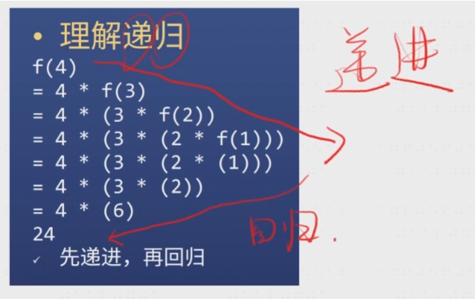

## JS 函数

函数是对象；

四种方式**定义函数**：

（1）具名函数：
```
function 函数名(形参1,形参2){
    语句
    return 返回值
}
```
（2）匿名函数

上面的具名函数，去掉函数名就是匿名函数；

let a = function(x,y){return x+y}  ；也叫函数表达式；

【P】：一个考点 and  JS 变态的地方；等于号右边的具名函数的作用域只在【function fn(x,y{return x+y})】; 脱离该作用域就不存在；
```
let f1 = function fn(x,y){return x+y}

fn(1,2)
→  Uncaught ReferenceError: fn is not defined

f1(1,2)
→  3
```
（3）箭头函数
```
let f1 = x => x*x
let f2 = (x,y) => x+y    //圆括号不能省略
let f3 = (x,y) => {return x+y}  //花括号不能省
let f4 = (x,y) => ({name:'x' , age:n})  //直接返回对象会出错
```
（4）用构造函数

let f = new Function('x','y','return x+y')

基本没人用；所有函数都有 Function 构造，包括 Object、Array、Function ；

箭头函数的 => 符号的左边就是输入参数，右边就是输出参数；当有两个参数，要用括号把两个参数括起来，语法才对，否则会有歧义；

当后面的部分不只是一句，那就需要用 {} 将后面的语句括起来，并且里面要加上 return ；

若一个函数是将参数转换为对象时，需要加（）；否则 JS 会认为是一个 label 标签（如：选中部分）；

函数本身  V.S  函数调用：fn V.S fn() ；

fn 只是函数名，fn() 调用函数后函数才会执行；
```
let fn = () => console.log('hi')
let fn2 = fn
fn2()
```
↑ fn保存了匿名函数的地址，该地址被复制给了 fn2 ，fn2() 调用了匿名函数；fn 与 fn2 都是匿名函数的引用而已，真正的函数既不是 fn 也不是 fn2。

**调用时机**：

函数的要素（每个函数都有这些东西）：调用时机，作用域，闭包，形式参数，返回值，调用栈，函数提升，arguments（除了箭头函数），this（除了箭头函数）；

调用时机：时机不同，结果不同； （类比举例：刻舟求剑）
```
let a = 1
function fn(){console.log(a)}
a = 2
fn()
→  2

let a = 1
function fn(){setTimeout(()=>{
    console.log(a)
},0)}
fn()
a = 2
→  2
```

let i = 0 ; for(i=0; … ){ …… }  :打印出 6 个 6；
for(let i=0; …… ){ …… }     ：打印出 0，1，2，3，4，5；

JS 在 for 与 let 一起用的时候会加东西，每次循环都会多创建一个 i ；

每次循环把 i 复制一份，不跟随新的 i 变化；  —— 刻舟求剑实现了！！！

setTimeout（……，0） 的意思是当你把手头的事情忙完，（马上）再去执行；（即先读完代码，再来打印）；

**作用域**：每个函数都会默认创建一个作用域；

function fn(){let a = 1}       // a的作用域只在 {} 区域

console.log(a)          // a 不存在；不管 fn()是否执行

全局变量 V.S 局部变量

在顶级作用域声明的变量是全局变量，window 的属性是全局变量，其他都是局部变量；

函数可嵌套；作用域也可嵌套；
```
function f1(){
    let a = 1
    function f2(){
        let a = 2
        console.log(a)
    }
    console.log(a)
    a = 3
    f2()
}
f1()
→  1，2
```
作用域规则：如果多个作用域有同名变量 a ，那么查找 a 的声明时，就向上取最近的作用域，简称 [就近原则] ，查找 a 的过程与函数执行无关，但 a 的值与函数执行有关；

//   跟函数执行没有关系的作用域叫静态作用域；也叫词法作用域；
```
function f1(){
    let a = 1
    function f2(){
        let a = 2
        function f3(){
            console.log(a)
        }
        a = 22
        f3()
    }
    console.log(a)
    a = 100
    f2()
}
→  1，22
```
**闭包**：JS 的函数会就近寻找最近的变量；如果一个函数用到了外部的变量，那么这个函数加这个变量就叫做闭包；如 ↑ 中的 f3() 中引入了外部域的 a ；

**形式参数**

形参的意思就是非实际参数，如 function add(x,y){return x+y} ；

如 ↑ 中 x 和 y 就是形参，因为并不是实际的参数；

调用 add 时，1 和 2 是实际参数，会被赋值给 x y ；

形参可认为（本质）是变量声明：上面代码等价于 ↓ ：
```
function add(){
    let x = arguments[0]
    let y = arguments[1]
    return x+y
}
```
关于值传递和地址传递；方方的理解：不用区分值传递和地址传递，所有东西都是根据内存图全部复制；

形参可多可少，形参只是给参数起名字；

**返回值**

每个函数都有返回值
```
function hi(){ console.log('hi')}    hi()
没写 return ，所以返回值是 undefined

function hi(){ return console.log('hi')}   hi()
返回值是 console.log('hi') 的值，即 undefined
```
函数执行完了后才会返回；

只有函数有返回值；1+2 返回值为 3（×）；1+2 值为 3（√） ；

**调用栈**：

什么是调用栈：JS 引擎在调用一个函数前，需要把函数所在的环境 push 到一个数组中，这个数组叫做调用栈，等函数执行完了，就会把环境弹（pop）出来，然后 return 到之前的环境，继续执行后续代码；

递归函数：

阶乘：function f(n){ return n !== 1 ? n*f(n-1) :1 }

理解递归：先递进再回归；递进的过程就是压栈的过程，回归的过程就是弹栈的过程；

如：阶乘的 f(4) 需压栈 4 次，弹栈 4 次；



递归函数的调用栈

递归函数的调用栈很长；

调用栈最长有多少？ Chrome 约 10000 ；firefox 约 20000 ；

爆栈：如果调用栈中压入的帧过多，程序就会崩溃；

**函数提升**：

什么是函数提升：function fn(){} ，即不管你把具名函数声明到哪里，它都会跑到第一行；

什么不是函数提升：let fn = function(){} ，这是赋值，右边的匿名函数声明不会提升；
```
add(1,2)
function add(a,b){return a+b}
→  3

add(1,2)
let add = function(a,b){return a+b}
→   add 未定义
let obj ={name:'lihua',add(a,b){return a+b}}
let obj2 = {name:'tom',f:function(a,b){return a+b}}
add(4,6)  → 10
f(1,2)  → f 未定义
obj2.f(1,2)  → 3
```
arguments 和 this ：每个函数都有，除了箭头函数；

arguments 是一个包含所有参数的伪数组；

如果不给任何条件，那么 this 默认指向 window ；

如果传的 this 不是对象，JS 会自动帮你封装成对象；
```
function fn(){
    console.log(arguments)
    console.log(this)
}
```
如何传 arguments ：调用 fn 即可传 arguments ；

fn(1,2,3)那么 arguments 就是 [1,2,3] 伪数组 ；

如何传 this ：目前可以用 fn.call(xxx,1,2,3) 传 this 和 arguments ；

而且 xxx 会被自动转化为对象（JS 的糟粕）；

（如果你声明函数时加上 'use strict' ，JS 就不会自动封装）；

this 是隐藏参数（方的个人结论），arguments 是普通参数；
```
假设没有 this ：
let person = {
    name:'frank' ,
    sayHi(){
    console.log(`你好，我叫`+ person.name)
    }
}
```
我们可以用直接保存了对象地址的变量获取‘name’；我们把这种办法简称为引用；

问题一：
```
let sayHi = function(){
    console.log(`你好，我叫`+ person.name)
}
let person = {
    name:'frank',
    'sayHi':sayHi
}
```
person 如果改名，sayHi 函数就挂了；sayHi 函数甚至有可能在另一个文件里面；
所以我们不希望 sayHi 函数里出现 person 引用；

问题二：
```
class Person{
    constructor(name){
       this.name = name 
        // 这里的 this 是 new 强制指定的
    }
    sayHi(){
        console.log(???)
    }
}
```
这里只有类，还没有创建对象，故不可能获取对象的引用；

那么如何拿到对象的 name ？？

一种土办法，用参数
```
// 对象
let person = {
    name : 'frank' ,
    sayHi(p){
        console.log('你好，我叫' + p.name)
    }
}
person.sayHi(person)
→   你好，我叫frank
```
```
// 类
class Person {
    constructor(name){ this.name = name }
    sayHi(p){
        console.log('你好，我叫' + p.name)
    }
}
```
Python 就用了 ↑ 述代码；

JS 在每个函数里加了 this ，用 this 获取那个对象
```
let person = {
    name:'frank'
    sayHi(this){
    console.log('你好，我叫' + this.name)
    }
}
```
person.sayHi() 相当于 person.sayHi(person)，然后 person 被传给 this 了（person是个地址）；这样，每个函数都能用 this 获取一个未知对象的引用了；

person.sayHi() 会隐式地把 person 作为 this 传给 sayHi，方便 sayHi 获取 person 对应的对象；

总结一下目前的知识：

我们想让函数获取对象的引用，但是并不想通过变量名做到，Python 通过额外的 self 参数做到，JS 通过额外的 this 做到：

**两种调用**：

小白调用法：person.sayHi() （会自动把 person 传到函数里，作为 this ）；

大师调用法：person.saiHi.call(person) （需要手动把 person 传到函数里，作为 this）；

应该学习哪种？学习大师调用法，因为小白调用法你早就会了；从这张 PPT 开始，默认用大师调用法； 小白调用隐藏了太多细节，只适合小白；从现在开始，你的函数调用必须用大师写法；
```
let person = {
    name:'frank',
    sayHi(){
    console.log('你好，我叫' + this.name)
    }
}
person.sayHi.call({name:'tom',age:55})
→   你好，我叫tom
```
this 的两种使用方法：

隐式传递:
```
fn(1,2)   //等价于 fn.call(undefined,1,2)
obj.child.fn(1)   //等价于 obj.child.fn.call(obj.child , 1 )
```
显式传递:
```
fn.call(undefined,1,2)
fn.apply(undefined,[1,2])
```

**绑定 this**

使用 .bind 可以让 this 不被改变:
```
function f1(p1,p2){
    console.log(this,p1,p2)
}
let f2 = f1.bind({name:'frank'})
// 那么 f2 就是 f1 绑定了 this 之后的新函数
f2()   //等价于 f1.call({name:'frank'})
→   {name: 'frank'} 
```
.bind 还可以绑定其他参数:
```
let f3 = f1.bind({name:'frank'},'hi')
undefined
f3()    //等价于 f1.call({name:'frank'},'hi')
→  {name: 'frank'} 'hi'
```
箭头函数：没有 arguments 和 this , 就算加 call 也没用 ;
```
console.log(this)
→   window
let fn = ()=>{console.log(this)}
fn()
→   window
fn.call({name:'tom'})
→   window
```
立即执行函数：只有 JS 有的变态玩意，现在用的少；

原理：ES 5时代，为了得到局部变量，必须引入一个函数；但是这个函数如果有名字，就得不偿失；于是这个函数必须是匿名函数，声明匿名函数，然后立即加个（）执行它，但是JS标准认为这种语法不合法，程序员发现只要在匿名函数前面加个运算符即可。如：！、～、（）、＋、－，但这些运算中有的会往上走，所以方方推荐永远用 ！来解决；
```
! function(){
    var a = 3
    console.log(a)
}()
→   3
// 新版语法
{
    const a = 3
    console.log(a)
}
→   3
```
如果有人在立即执行函数上加了（），你就要在上一句末加上 分号（ ；），这是 JS 中唯一需要加 ；的地方。