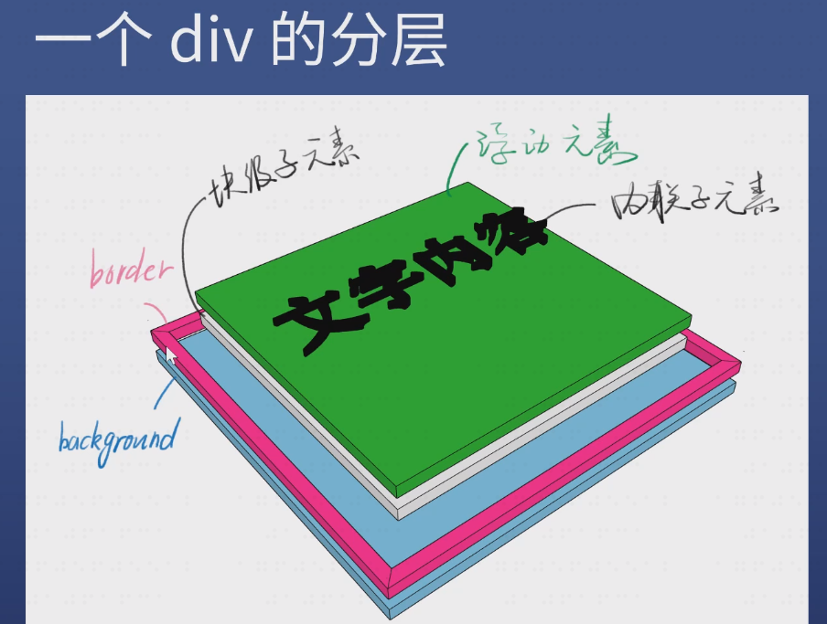
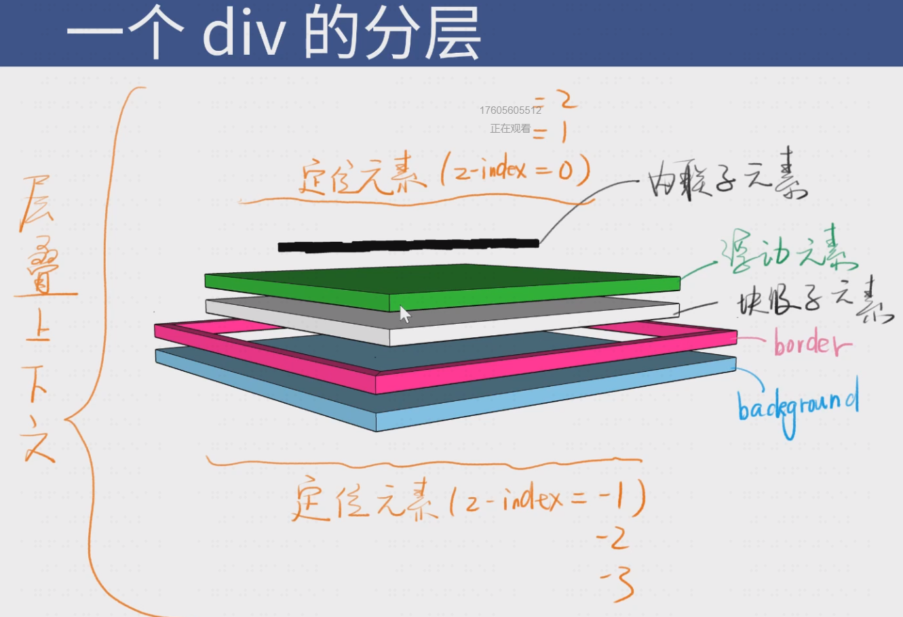
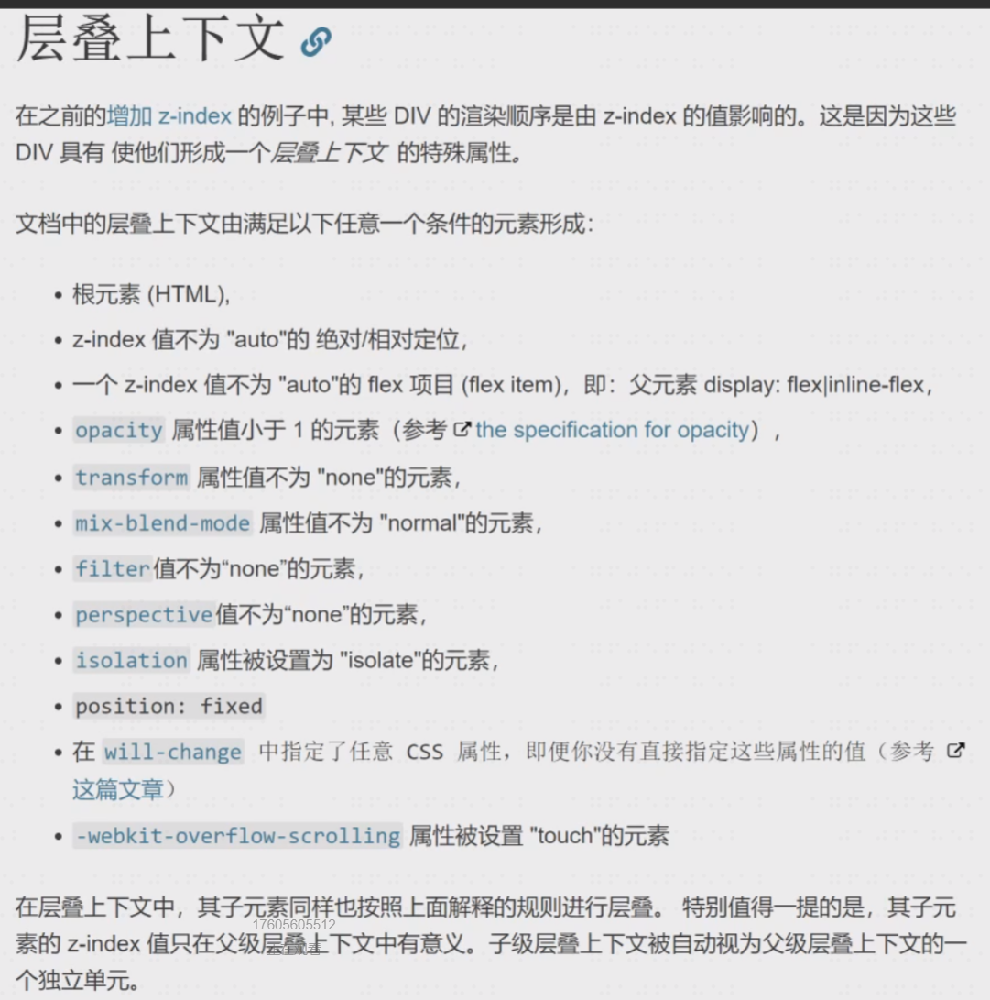

## CSS定位

布局与定位：布局是屏幕平面上的，定位是垂直于屏幕的；

背景的范围是从哪到哪？border 外边沿围成的区域；

CSS中文字在 border 上面，border 在 background 上面，

文字内容和块级子元素的文字内容的层叠取决于出现的先后顺序；

浮动元素脱离文档流，其实就是浮起来了一点点；

### 新属性-positon：

static 默认值，待在文档流里；

relative 相对定位，升起来，但不脱离文档流；

absolute 绝对定位，定位基准是祖先里的非 static；

⭐（absolute 是 相对于祖先元素中最近的一个定位元素定位[position不为static]的；）

fixed 固定定位，定位基准是 viewport（有诈）；

sticky 粘滞定位，不好描述直接举例；

经验：如果你写了 absolute ，一般都得补一个 relative；

如果你写了 absolute 或 fixed ，一定要补 top 和 left；

sticky 兼容性很差，主要用于面试装逼；

**position: relative**

使用场景：用于做位移（很少用）；用于给 absolute 元素做爸爸（一会讲）

配合 z-index ：

z-index：auto 默认值，不创建新层叠上下文；

z-index：0/1/2/-1/-2 ；

经验：写 z-index：9999 的都是彩笔；学会管理 z-index；

**position：absolute**

使用场景：脱离原来的位置，另起一行，比如对话框的关闭按钮；鼠标提示；

配合 z-index；

经验：很多彩笔都以为 absolute 是相对于 relative 定位的；

某些浏览器上如果不写 top/left 会位置错乱；（如：top：0；right：0；）

善用 left：100% ；

善用 left：50%；加负 margin；

[P]：white-space：nowrap；（文字内容不准换行；）

**position：fixed**；（相对于视口定位，但若其父元素有transform属性，则其功能失效）

使用场景：烦人的广告；回到顶部按钮；

配合 z-index；

经验：手机上尽量不要用这个属性，坑很多；

### 层叠上下文：

定位元素要么在上要么在下，不存在中间的层次；但定位元素不会超出层叠上下文（即HTML）；

z-index：10 ；和 z-index：5；哪个高？→ 看情况

层叠上下文：

比喻：每个层叠上下文就是一个新的小世界（作用域）；这个小世界里面的 z-index 跟外界无关，处在同一个小世界的 z-index 才能比较；

哪些不正交的属性可以创建层叠上下文：MDN 文档有写；

需要记忆的有 z-index / flex / opacity /transform ；

知道这些知识的面试官也不太多，不用花时间背；忘了就搜 [层叠上下文MDN]；

负 z-index 与层叠上下文：记住负 z-index 逃不出小世界；（如：负的z-index逃不出上一层元素的背景，因为上一层元素也是层叠上下文；）
