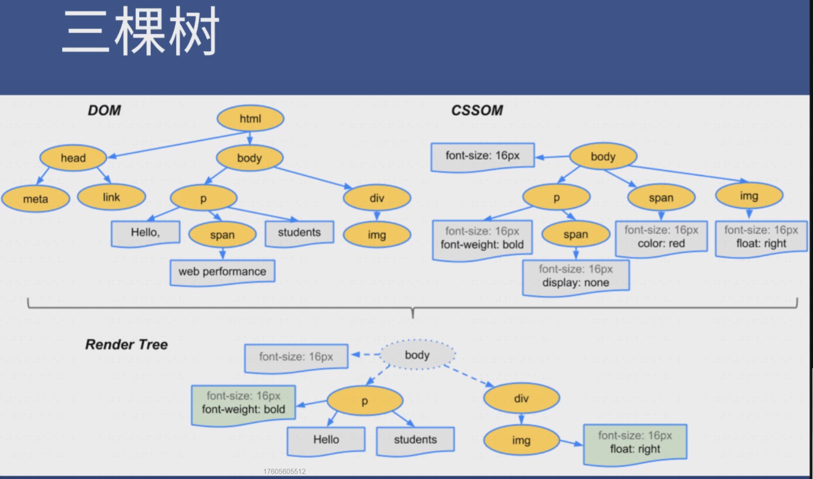

## CSS动画

注意性能：绿色代表重新绘制了（repaint）了；

CSS 渲染过程依次包含布局、绘制、合成，其中布局和绘制有可能被省略；

[P]：一般来说，前端高手是不用 setInterver 的；因为它容易出错；

**浏览器渲染过程：**

步骤：根据 HTML 构建 HTML 树（DOM）

根据 CSS 构建 CSS 树（CSSOM）

将两棵树合并成一棵渲染树（render tree）

Layout 布局（文档流、盒模型、计算大小和位置）

Paint 绘制（把边框颜色、文字颜色、阴影等画出来）

Compose 合成（根据层叠关系展示画面）



<br>

### 更新样式？

一般我们用 JS 来更新样式

比如 div.style.background = 'red' , div.style.display = 'none' , 

比如 div.classList.add('red')   （加样式不如加类，因为一个类里面可以有很多样式）

比如 div.remove() 直接删掉节点

三种更新样式方式：


一、全走：div.remove()会触发当前消失，其他元素 relayout ；

二、跳过 layout ：改变背景颜色，直接 repaint + composite

三、跳过 layout 和 paint ：改变 transform，只需 composite 

如何知道每个属性触发哪些流程？csstriggers.com

前端高手不用 left 做动画，用 **transform** （变形）

原理：transform: translateX(0 => 300px)

直接修改会被合成，需要等一会修改

transition 过渡属性可以自动补充中间帧

注意性能：并没有 repaint （重新绘制），比改 left 性能好；

<br>

### CSS 动画优化：

答案都在：https://developers.google.com/web/fundamentals/performance/rendering/stick-to-compositor-only-properties-and-manage-layer-count

JS 优化：使用 requestAnimationFrame 代替 setTimeout 或 setInterval

CSS 优化：使用 will-change 或 translate 

<br>

### transform 

四个常用功能:  位移 translate ； 缩放 scale ；旋转 rotate ；倾斜 skew ；

经验：一般都需要配合 transition 过渡；

inline 元素不支持 transform ，需要先变成 block ；

transform 之 **translate**
```
常用写法： translateX（<length-percentage>）
translateY（<length-percentage>）
translate（<length-percentage>，<length-percentage>？）
translateZ（<length>）且父容器 perspective
translate3d（x,y,z） 
```
经验：学会看懂 MDN 的语法示例；

translate(-50%，-50%)可做绝对定位元素的居中；
`【left:50%;top:50%;transform:translate(-50%,-50%);】`

transform 之 **scale**
`常用写法：scaleX(<number>) ; scaleY(<number>) ；scale(<number>,<number>?)`

经验：用的较少，因为容易出现模糊；

transform 之 **rotate**
`常用写法：rotate（[<angle> | <zero>]）；rotateX（[<angle> | <zero>]）；rotateY（[<angle> | <zero>]）；rotateZ（[<angle> | <zero>]）；`
`如：【 transform: rotate(60deg); 】`

rotate3d 太复杂，无法用语言描述；

经验：一般用于 360 度旋转制作 loading ；

用到时再搜索 rotate MDN 看文档；

transform 之 skew（倾斜）
`常用写法：skewX([<angle> | <zero>]) ；skewY([<angle> | <zero>]) ；skew([<angle> | <zero>], [<angle> | <zero>]?) ；`

经验：用的较少；用到时再搜 skew MDN 文档；

transform 多重效果：
`组合使用：transform: sacle(0.5)  translate(-100%, -100%) ;`

transform: none ; 取消所有；

**实践**：跳动的心，献给大家；

心得：CSS 需要你有想象力，而不是逻辑；

CSS 给出的属性都很简单，但是可以组合得很复杂；

<br>

### transition 过渡

作用：补充中间帧；语法：→

```
transtion: 属性名 时长 过渡方式 延迟；
transition: left 200ms linear；
可以用逗号分隔两个不同的属性；
transtion: left 200ms ,top 400ms ;
可以用 all 代表所有属性；
transition: all 200ms ;
过渡方式有：linear | ease | ease-in | ease-out | ease-in-out | cubic-bezier | step-start | step-end | steps ，具体含义要靠数学知识
```

注意：不是所有属性都能过渡

display: none => block 没法过渡

一般改成 visibility: hidden => visible

display 和 visible 的区别自己搜一下；

background 颜色可以过渡吗？（√）opacity 透明度可以过渡吗？ （√）

过渡必须要有起始，一般是 hover 和非 hover 状态的过渡；

怎么实现**多次动画？**两种办法：

（1）使用两次 transform

.a === transform ===>.b

.b === transform ===>.c

如何知道到了中间点呢？用 setTimeout 或者监听 transitionend 事件

（2）使用 animation ：声明关键帧；添加动画；

@keyframes 完整语法：from to 写法 和 百分比写法；


**animation** 

```
缩写语法：animation | 时长 | 过渡方式 | 延迟 | 次数 | 方向 | 填充模式 | 是否暂停 | 动画名；
时长：1s 或者 1000ms；
过渡方式：跟 transition 取值一样，如 linear
次数：3 或者 2.4 或者 infinite
方向：reverse | alternate | alternate-reverse 
填充模式：none | forwards | backwards | both 
是否暂停：paused | running
```

alternate非常适合做加载动画；（反复来回）
